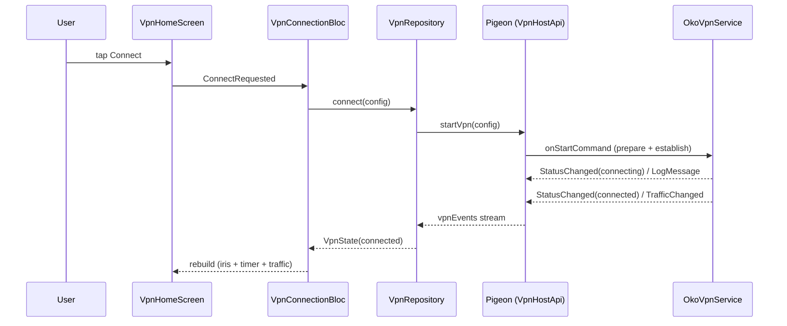

# Phase 6: Подача — Research

**Researched:** 2026-07-14
**Domain:** Техническая документация (README + mermaid), CI на GitHub Actions, план интеграции VPN-core, сценарий видео-демо
**Confidence:** HIGH (README/архитектура — из проверенного кодовой базы; CI — синтаксис subosito/flutter-action сверен с README действия), MEDIUM (DOC-03: gomobile-таргеты sing-box/libbox проверены веб-поиском, конкретные символы API — из памяти модели)

## Summary

Фаза 6 не пишет продуктовый код и не ставит новых pub-пакетов. Она превращает готовый прототип (фазы 1-5, 30/31 плана закрыты) в сдаваемый артефакт: README на русском с mermaid-диаграммой, зелёный CI-бейдж и видео 1-3 минуты. Весь фактический материал для README уже лежит в кодовой базе — контракт Pigeon, `OkoVpnService`, `PacketTunnelProvider`, VLESS-парсер, DI, темы, тесты. Задача планировщика — собрать это в честный документ, а не изобрести новое.

Главный технический раздел — DOC-03 «План интеграции VPN-core». В коде уже есть точная точка подключения: `OkoVpnService.startReadLoop()` читает пакеты из TUN-fd и дропает их (считает только rx, tx всегда 0), а `PacketTunnelProvider.startTunnel` поднимает туннель, но не трогает `packetFlow`. Именно сюда встал бы sing-box/libbox (Android `.aar` + iOS `.xcframework` из одного `gomobile bind`). README должен назвать этот шов и предложить интерфейс `VpnCore`, которого в коде пока нет.

CI прямолинеен: `subosito/flutter-action@v2` на `ubuntu-latest`, `flutter analyze` + `flutter test`, без сборки APK. Pigeon-код закоммичен (`lib/core/bridge/vpn_api.g.dart`), кодоген на CI не нужен. Единственный риск зелёного прогона — виджет-тесты с `google_fonts` в headless-окружении; шрифты забандлены офлайн, но план обязан прогнать точную CI-команду на чистом чекауте до пуша.

**Primary recommendation:** README на русском из пяти блоков (Запуск → Архитектура+mermaid → iOS → План интеграции core → Ограничения/что дальше); CI-workflow `subosito/flutter-action@v2` + `flutter analyze` + `flutter test` на `ubuntu-latest`, бейдж клик-ссылкой; видео и создание публичного GitHub-репозитория — checkpoint-шаги пользователя.

<project_constraints>
## Project Constraints (из PROJECT.md / STATE.md / CONVENTIONS.md / CLAUDE.md)

CONTEXT.md для фазы 6 не создавался (`has_context: false`). Ниже — залоченные решения из проектных документов, обязательные для планировщика. Авторитет тот же, что у CONTEXT-решений.

### Locked Decisions (релевантные фазе 6)
- **README на русском**, идентификаторы/код/yaml/mermaid — английский `[CITED: PROJECT.md Key Decisions; CONVENTIONS.md Язык]`
- **ТЗ-docx не коммитится** — `ТЗ_*.docx` уже в `.gitignore` (строка 48) `[VERIFIED: .gitignore]`
- **CI без сборки APK** — только `flutter analyze` + `flutter test` (сборка долгая и хрупкая) `[CITED: FEATURES.md строка 47, 119]`
- **Без комментариев в коде** — распространяется и на CI-yaml по духу правила; в yaml допустимы служебные ключи, не пояснительные комментарии `[CITED: CONVENTIONS.md]`
- **Маршрут TUN — узкая подсеть 10.111.222.0/24**, не 0.0.0.0/0; интернет живёт в Connected — честно описать в README `[VERIFIED: OkoVpnService.kt addRoute; PacketTunnelProvider.swift includedRoutes]`
- **Демо-конфиг VLESS — фейковый** (`00000000-...-000000000000`, host `echo.oko.vpn`); реальную ссылку пользователь вставляет на демо, в репо она не попадает `[VERIFIED: lib/app/di.dart demoConfig]`
- **Вставленный vless-конфиг display-only** — не проводится в реальный Connect (`VpnConnectionBloc.config` остаётся demoConfig) `[VERIFIED: STATE.md 04-05]`
- **iOS реальный туннель проверяется только на устройстве через TestFlight** — симулятор NE-appex не хостит `[VERIFIED: DOC-02-ios-setup.md]`

### Из глобального CLAUDE.md пользователя
- Весь текст для пользователя (README, commit-сообщения, PR) — русский; технические идентификаторы и цитаты кода — английский
- stop-slop: активный залог, без филлеров, конкретика, без em-dash, варьировать ритм — применять к README и всем текстам
- Test-as-you-go: перед коммитом весь набор зелёный (для фазы 6 = зелёный CI локально до пуша)
</project_constraints>

<phase_requirements>
## Phase Requirements

| ID | Description | Research Support |
|----|-------------|------------------|
| DOC-01 | README: инструкция запуска, mermaid-диаграмма Flutter → Pigeon → VpnService / Network Extension, что open-source и что своё | Раздел «README: структура и содержание» + «Mermaid-диаграмма» + таблицы open-source/своё ниже; все факты из кодовой базы |
| DOC-02 | README-раздел iOS: capabilities, entitlements, App Groups, app↔extension, ограничения симулятора | Готовый `DOC-02-ios-setup.md` (фаза 5) адаптируется в README; содержимое сверено с entitlements/Info.plist проекта |
| DOC-03 | README-раздел «План интеграции VPN-core»: sing-box/xray/libv2ray, Android .aar, iOS .xcframework, FFI/JNI/gomobile, точки подключения (интерфейс VpnCore) | Раздел «DOC-03: план интеграции core» — точная точка в `OkoVpnService.startReadLoop` и `PacketTunnelProvider.startTunnel`; gomobile/libbox verified веб-поиском |
| DOC-04 | CI GitHub Actions: flutter analyze + flutter test, бейдж в README | Раздел «DOC-04: CI» — готовый workflow, синтаксис subosito/flutter-action@v2 сверен, бейдж-markdown |
| DOC-05 | Видео-демо 1-3 минуты: запуск, Connect, статусы/логи/трафик, Disconnect | Раздел «DOC-05: сценарий видео» — покадровый чеклист; запись = checkpoint пользователя |
</phase_requirements>

## Architectural Responsibility Map

| Capability | Primary Tier | Secondary Tier | Rationale |
|------------|-------------|----------------|-----------|
| README + mermaid (DOC-01/02/03) | Docs (корень репо) | — | Файл `README.md` в корне; GitHub рендерит markdown+mermaid нативно |
| CI-пайплайн (DOC-04) | CI/DevOps (`.github/workflows/`) | — | Workflow исполняется раннером GitHub, не приложением; не трогает `lib/`/`android/`/`ios/` |
| Бейдж статуса (DOC-04) | Docs (README) | CI/DevOps | Бейдж — картинка из CI-эндпоинта, встроенная в README |
| Видео-демо (DOC-05) | Manual / Human | — | Ручная запись экрана устройства; агент готовит сценарий, снимает пользователь |
| Публичный репозиторий + push | Manual / Human | CI/DevOps | Git remote сейчас не настроен; создание репо и пуш — действие пользователя, от него зависят бейдж и сдача |

## Standard Stack

Фаза 6 **не добавляет pub-пакетов**. Существующие зависимости (проверены в `pubspec.yaml`) упоминаются в README как «что использовано open-source».

### Core (уже в проекте, для таблицы «open-source» в README)
| Library | Version | Purpose | Why Standard |
|---------|---------|---------|--------------|
| pigeon | ^27.1.1 | Типобезопасный мост Flutter↔native | Официальный кодоген команды Flutter; единственный кодоген в проекте `[VERIFIED: pubspec.yaml]` |
| flutter_bloc | ^9.1.1 | State management | Явная event-driven машина состояний `[VERIFIED: pubspec.yaml]` |
| equatable | ^2.1.0 | Value equality доменных моделей | sealed + immutable без freezed `[VERIFIED: pubspec.yaml]` |
| google_fonts | ^8.1.0 | Шрифты Inter/JetBrainsMono/SpaceGrotesk (офлайн-бандл) | Забандлены в `google_fonts/` как asset `[VERIFIED: pubspec.yaml + google_fonts/]` |

### Supporting (dev-зависимости, для таблицы README)
| Library | Version | Purpose | When to Use |
|---------|---------|---------|-------------|
| very_good_analysis | ^10.3.0 | Строгий линтинг | Сигнал качества ревьюеру; `flutter analyze` на CI `[VERIFIED: pubspec.yaml + analysis_options.yaml]` |
| mocktail | ^1.0.5 | Моки без кодогена | Юнит-тесты репозиториев/Bloc `[VERIFIED: pubspec.yaml]` |
| bloc_test | ^10.0.0 | Тесты Bloc/Cubit-переходов | Сценарии error/onRevoke `[VERIFIED: pubspec.yaml]` |
| flutter_lints | ^6.0.0 | Базовые линты (транзитивно) | Идёт в комплекте шаблона `[VERIFIED: pubspec.yaml]` |
| flutter_test | SDK | Юнит/виджет-тесты | 122 объявления тестов в `test/` `[VERIFIED: grep test/]` |

### CI-инструменты (новое в фазе 6 — не pub-пакеты, а GitHub Actions)
| Action | Version | Purpose | Notes |
|--------|---------|---------|-------|
| `subosito/flutter-action` | `@v2` (последний релиз v2.23.0, март 2026) | Ставит Flutter SDK на раннер | Поддерживает `flutter-version` и `channel`; кэш через `actions/cache` внутри `[CITED: github.com/subosito/flutter-action README]` |
| `actions/checkout` | `@v4` (major-пин) | Чекаут репозитория | Пинить major-тег; проверить актуальный major перед записью `[ASSUMED]` |

**Установка новых pub-пакетов:** нет. `flutter pub get` на CI подтягивает уже зафиксированные в `pubspec.lock`.

**Version verification (выполнено):**
- Локально: `Flutter 3.44.5 • channel stable • Dart 3.12.2` (revision f94f4fc76b, 2026-07-06) `[VERIFIED: flutter --version]`
- CI должен пинить `flutter-version: 3.44.5` + `channel: stable` для воспроизводимости (совпадение с локальной средой разработки).

## Package Legitimacy Audit

Фаза 6 **не устанавливает pub/npm/PyPI-пакетов**. Единственные внешние артефакты — GitHub Actions.

| Package/Action | Registry | Age | Downloads/Usage | Source Repo | slopcheck | Disposition |
|----------------|----------|-----|-----------------|-------------|-----------|-------------|
| `subosito/flutter-action` | GitHub Marketplace | ~5 лет | Де-факто стандарт Flutter CI, тысячи репозиториев | github.com/subosito/flutter-action | N/A (не npm/pip) | Approved — пинить `@v2` |
| `actions/checkout` | GitHub Marketplace | ~6 лет | Официальный action GitHub | github.com/actions/checkout | N/A | Approved — пинить major |

**Packages removed due to slopcheck [SLOP] verdict:** none (нет pub/npm-установок).
**Packages flagged as suspicious [SUS]:** none.

slopcheck неприменим к GitHub Actions в модели pub/npm-реестра. Оба action — официальные/де-факто-стандартные, с публичным исходником и многолетней историей. Рекомендация: **пинить теги** (`@v2`, `@v4`), не использовать `@master`/`@main`; при желании — пин по SHA-коммиту для полной воспроизводимости.

## Architecture Patterns

### System Architecture Diagram (для README, DOC-01)

Готовая mermaid-диаграмма ниже валидна для нативного рендера GitHub (`flowchart`). Прослеживается основной сценарий Connect слева-направо-вниз.

```mermaid
flowchart TD
  UI["Presentation: VpnHomeScreen + widgets<br/>(iris indicator, logs, server card)"] -->|user intent| BLOC["Bloc/Cubit: VpnConnectionBloc,<br/>LogsCubit, ServerConfigCubit"]
  BLOC -->|calls| UC["Usecases: ConnectVpn, DisconnectVpn,<br/>WatchVpnState, WatchTraffic, WatchLogs"]
  UC -->|domain interfaces| REPO["Repositories: VpnRepository, LogRepository"]
  REPO -->|impl| DS["Datasources: VpnNativeDatasource,<br/>LogNativeDatasource"]
  DS --> BR["VpnBridge<br/>(single owner of Pigeon stream)"]
  BR -->|VpnHostApi: startVpn / stopVpn / getStatus| PG["Pigeon generated<br/>(Dart / Kotlin / Swift)"]
  PG -.->|@EventChannelApi vpnEvents| BR
  PG --> ANDROID["Android: VpnHostApiImpl<br/>-> OkoVpnService"]
  PG --> IOS["iOS: VpnHostApiImpl<br/>-> NETunnelProviderManager"]
  ANDROID --> TUN["VpnService.Builder.establish()<br/>-> TUN fd -> read-loop (counts rx, drops packets)"]
  IOS --> NE["PacketTunnelProvider (NE extension)<br/>setTunnelNetworkSettings"]
  TUN -.->|StatusChanged / LogMessage / TrafficChanged / Error| PG
  NE -.->|NEVPNStatus observer| IOS
  IOS -.->|events| PG
```

**Альтернатива — sequenceDiagram потока Connect** (можно дать вместо или вдобавок; тоже нативно рендерится GitHub):



**Проверка синтаксиса mermaid:** `flowchart TD` и `sequenceDiagram` — стабильные типы, GitHub рендерит без плагинов. Правила, которые план обязан соблюсти: метки со спецсимволами и `<br/>` — в кавычках `["..."]`; стрелки `-->` (сплошная) и `-.->` (пунктир для событий); ID узлов латиницей. Не использовать реальные `/` вне кавычек в метках. Confidence: HIGH `[CITED: mermaid flowchart/sequence — стандарт; GitHub docs про нативный рендер]`.

### Component Responsibilities (маппинг файл→роль для README)
| Слой | Файлы | Роль |
|------|-------|------|
| presentation | `lib/features/*/presentation/` | Виджеты + Bloc/Cubit; ирис-индикатор `iris_painter.dart` (CustomPainter), панель логов, карточка сервера |
| domain | `lib/features/*/domain/` | sealed/immutable entity, usecases, интерфейсы репозиториев |
| data | `lib/features/*/data/` | Реализации репозиториев, мапперы DTO→entity, датасорсы поверх `VpnBridge` |
| core/bridge | `lib/core/bridge/` | `vpn_api.g.dart` (Pigeon) + `VpnBridge` — единственный подписчик event-канала |
| Android native | `android/.../vpn/`, `android/.../bridge/` | `OkoVpnService`, `VpnConsentGateway`, `VpnEventBus`, `VpnConnectionState`, `VpnHostApiImpl` |
| iOS native | `ios/Runner/Bridge/`, `ios/PacketTunnel/` | `VpnHostApiImpl`, `VpnStatusObserver`, `PacketTunnelProvider` |

### Recommended Project Structure для README-блока «Структура»
```
lib/
├── app/                      # composition root (di.dart), MaterialApp (app.dart)
├── core/
│   ├── bridge/               # Pigeon g.dart + VpnBridge (демультиплексор)
│   ├── error/                # Failure-типы
│   └── theme/                # темы, токены, типографика, VpnStatus
└── features/
    ├── vpn_connection/       # domain / data / presentation (мост, экран, ирис)
    ├── vpn_logs/             # живой блок логов
    └── server_config/        # VLESS-парсер, карточка, tcping
pigeons/vpn_api.dart          # контракт моста (источник кодогена)
android/app/src/main/kotlin/  # VpnService, FGS, event bus, host api
ios/Runner/ + ios/PacketTunnel/ # Swift-мост + NE-таргет
test/                         # 122 теста: парсер, мапперы, Bloc, виджеты
.github/workflows/ci.yml      # НОВОЕ в фазе 6
```

### Anti-Patterns to Avoid
- **README-«вода» и маркетинг:** ревьюер оценивает инженерную честность. Каждое ограничение называть прямо (нет core → трафик не проксируется, tx=0, iOS только TestFlight), а не прятать.
- **CI со сборкой APK/IPA:** долго и хрупко на раннере, ноль пользы для критериев ТЗ. Только analyze+test `[CITED: FEATURES.md]`.
- **Кодоген Pigeon на CI:** `vpn_api.g.dart` закоммичен — регенерация лишний шаг и риск дрейфа. CI просто использует закоммиченный файл `[VERIFIED: lib/core/bridge/vpn_api.g.dart в дереве]`.
- **Реальный VLESS/UUID/DEVELOPMENT_TEAM в README или репо:** демо-конфиг фейковый, team читается из ENV с фолбэком (решение 05 LO-01). Не вписывать секреты в примеры.

## Don't Hand-Roll

| Problem | Don't Build | Use Instead | Why |
|---------|-------------|-------------|-----|
| Рендер диаграммы архитектуры | SVG/PNG-картинку вручную или сторонний сервис | mermaid в fenced-блоке ```` ```mermaid ```` | GitHub рендерит нативно, диаграмма живёт в git, правится текстом `[CITED: GitHub docs]` |
| Установка Flutter на раннере | Ручной curl+распаковка+PATH SDK | `subosito/flutter-action@v2` | Кэш SDK/pub, кросс-ОС, поддержка версии/канала из коробки `[CITED: subosito README]` |
| Бейдж статуса сборки | Свой shield или скрипт | Нативный эндпоинт `.../actions/workflows/ci.yml/badge.svg` | GitHub генерирует и обновляет сам `[CITED: GitHub docs status badge]` |
| Матрица версий Flutter | Своя логика | `channel`/`flutter-version` инпуты action | Пин 3.44.5 stable = воспроизводимость `[CITED: subosito README]` |

**Key insight:** фаза 6 — это сборка готовых артефактов, а не разработка. Любой «самопал» (картинка-диаграмма, ручная установка SDK) добавляет хрупкости без ценности для ревьюера.

## DOC-03: план интеграции VPN-core (ключевой технический раздел README)

Это самый содержательный раздел. Ниже — точный материал, который планировщик кладёт в задачу написания README.

### Точка подключения в коде (главное, что ищет ревьюер)

**Android — `OkoVpnService.startReadLoop()`** (`android/app/src/main/kotlin/com/example/vpn_oko/vpn/OkoVpnService.kt`, строки 79-98): сейчас поток читает пакеты из `pfd.fileDescriptor` в буфер и **дропает их**, суммируя только прочитанные байты (`rx.addAndGet(read)`); tx не измеряется (эмитится `TrafficChangedMessage(rx.get(), 0L)`, строка 105). Сюда встаёт реальный core:
- `Builder.establish()` (строка 120) уже отдаёт TUN `ParcelFileDescriptor`.
- Вместо read-loop дескриптор передаётся в core: `libbox`/sing-box принимает fd туннеля и берёт на себя чтение/запись/проксирование.
- Метод `VpnService.protect(socket)` защищает исходящий сокет core от зацикливания в туннель — это точка, которую core вызывает через колбэк.

**iOS — `PacketTunnelProvider.startTunnel`** (`ios/PacketTunnel/PacketTunnelProvider.swift`, строки 4-20): сейчас только `setTunnelNetworkSettings`, `self.packetFlow` не читается. Реальный core:
- Тот же sing-box, собранный под iOS, запускается внутри extension-процесса.
- Цикл `packetFlow.readPackets` ↔ core ↔ `packetFlow.writePackets` (или core сам держит tun через `Libbox` tun-адаптер).

### Предлагаемый интерфейс VpnCore (в коде пока НЕТ — это план)

Ревьюер прямо просит «точки подключения (интерфейс VpnCore)». В коде такого интерфейса нет; README описывает, как его ввести:

```kotlin
// Android: android/.../vpn/VpnCore.kt (план, не существует)
interface VpnCore {
  fun start(tunFd: ParcelFileDescriptor, config: VlessConfig, protect: (Int) -> Boolean)
  fun stop()
  fun stats(): TrafficStats   // rx + tx из core, не из read-loop
}
// Реализация LibboxVpnCore оборачивает gomobile-биндинг libbox;
// OkoVpnService.startReadLoop заменяется на vpnCore.start(descriptor, config, ::protect)
```

```swift
// iOS: ios/PacketTunnel/VpnCore.swift (план, не существует)
protocol VpnCore {
  func start(packetFlow: NEPacketTunnelFlow, config: VlessConfig) throws
  func stop()
}
// LibboxVpnCore внутри PacketTunnelProvider.startTunnel вместо голого setTunnelNetworkSettings
```

Мост **Pigeon не меняется**: контракт `startVpn(VpnConfigMessage)` + поток событий уже покрывает интеграцию — это сильный аргумент для README (архитектура заложена под core, менять фасад не придётся).

### Механика FFI / JNI / gomobile

| Платформа | Артефакт | Инструмент | Механика |
|-----------|----------|-----------|----------|
| Android | `libbox.aar` (или `libXray.aar`) | `gomobile bind -target=android` | AAR несёт .so под ABI + JNI-обёртку Java/Kotlin; вызывается in-process из `OkoVpnService`, без gRPC/localhost `[CITED: pkg.go.dev/golang.org/x/mobile/cmd/gomobile; веб-поиск sing-box AAR]` |
| iOS | `Libbox.xcframework` | `gomobile bind -target=ios` (генерит ios+iossimulator) | XCFramework линкуется в extension-таргет; Swift зовёт Obj-C-биндинг core `[CITED: github.com/SagerNet/sing-box issue #3163 Libbox xcframework]` |
| Flutter↔native | — | Pigeon (уже есть) | Dart FFI **не нужен**: core живёт в native VpnService/NE-процессе, не в Dart-изоляте. Flutter общается с native только через Pigeon |

Важный акцент для README: **Dart FFI здесь не место интеграции** — частая ошибка. Core запускается в нативном VPN-процессе (Android Service / iOS NE extension), а Flutter остаётся UI-слоем поверх Pigeon-моста.

### Варианты core (назвать в README, sing-box первичный)

| Core | Артефакт | Статус | Рекомендация |
|------|----------|--------|--------------|
| **sing-box / libbox** | `.aar` + `.xcframework` из `gomobile bind -target=android/ios` | Официальные gomobile-таргеты; активный проект (SagerNet) `[CITED: веб-поиск libbox pkg.go.dev + issue #3163]` | Первичный: единый core на обе платформы, VLESS-outbound из коробки |
| **Xray-core / libXray** | gomobile-обёртка Xray → `.aar` / `.xcframework` | libXray — сторонний gomobile-wrapper Xray-core `[ASSUMED]` | Альтернатива: если нужен именно Xray/XTLS |
| **libv2ray** | легаси gomobile-биндинг v2ray (v2rayNG) | старше, v2ray-эпоха `[ASSUMED]` | Упомянуть как исторический вариант, не рекомендовать |

Конфиг-маппинг: `VlessConfig` (уже распарсен на Dart в фазе 4) передаётся через `startVpn` → на native собирается sing-box JSON с `vless`-outbound → отдаётся в `Libbox.newService(config)`. Конкретные имена символов (`Libbox.newService`, `TunOptions`) — `[ASSUMED]` из памяти, в README давать как «примерно так», не как проверенный API.

Confidence DOC-03: MEDIUM — общая механика (gomobile bind → aar/xcframework, in-process JNI, core в NE-процессе) verified веб-поиском; точные API-символы sing-box/libbox не проверены в этой сессии, помечены ASSUMED.

## DOC-04: CI на GitHub Actions

### Готовый workflow (материал для задачи)

```yaml
# .github/workflows/ci.yml
name: CI

on:
  push:
    branches: [main]
  pull_request:
    branches: [main]

jobs:
  analyze-and-test:
    runs-on: ubuntu-latest
    steps:
      - uses: actions/checkout@v4
      - uses: subosito/flutter-action@v2
        with:
          channel: stable
          flutter-version: 3.44.5
      - run: flutter pub get
      - run: flutter analyze
      - run: flutter test
```

**Проверенные решения:**
- `subosito/flutter-action@v2` с инпутами `channel` и `flutter-version` — синтаксис сверен с README действия (последний релиз v2.23.0, март 2026) `[CITED: github.com/subosito/flutter-action]`.
- `ubuntu-latest` достаточно: не собираем iOS/APK, значит macOS-раннер (дорогой, медленный) не нужен.
- `actions/setup-java` **не требуется**: analyze+test без Gradle-сборки Android `[CITED: subosito README — Java не в пререквизитах]`.
- Кодоген Pigeon не запускается: `vpn_api.g.dart` закоммичен `[VERIFIED: дерево lib/core/bridge/]`.
- Пин `flutter-version: 3.44.5` = совпадение с локальной средой (Dart 3.12.2) → воспроизводимость `[VERIFIED: flutter --version]`.

### Бейдж в README (DOC-04)

```markdown
[](https://github.com/<owner>/<repo>/actions/workflows/ci.yml)
```

Формат `.../actions/workflows/<file>/badge.svg`; клик-обёртка ведёт на страницу прогонов `[CITED: docs.github.com — Adding a workflow status badge]`. `<owner>/<repo>` подставляются после создания публичного репозитория (см. Environment Availability — remote сейчас не настроен).

### Риск зелёного прогона (обязательная проверка плана)

`flutter test` включает виджет-тесты с `google_fonts`. Шрифты забандлены офлайн (`google_fonts/Inter-*.ttf`, `JetBrainsMono-*.ttf`, `SpaceGrotesk-*.ttf`), matching по имени файла. Гварда `GoogleFonts.config.allowRuntimeFetching = false` в тестах **нет** `[VERIFIED: grep — не найден]`. Обычно google_fonts находит бандл в asset-манифесте и не ходит в сеть, тесты проходят. Но headless CI без сети — классический источник флейка. **План обязан:** прогнать точную последовательность `flutter pub get && flutter analyze && flutter test` на чистом чекауте (лучше с отключённой сетью) до пуша, и только зелёный результат коммитить. При флейке — добавить `GoogleFonts.config.allowRuntimeFetching = false` в `flutter_test_config.dart` или setup тестов.

`flutter analyze` со строгим `very_good_analysis` — генерённые файлы исключены (`analyzer.exclude: **/*.g.dart`, `pigeons/**`), так что analyze не спотыкается о кодоген `[VERIFIED: analysis_options.yaml]`. Всё равно прогнать локально: analyze падает на любом info/warning.

## DOC-05: сценарий видео-демо (1-3 минуты)

Запись — **checkpoint пользователя** (ручной шаг). План даёт покадровый чеклист, агент не записывает.

| Такт | Время | Действие | Что видно на экране |
|------|-------|----------|---------------------|
| 1 | 0:00-0:15 | Запуск приложения на Android-устройстве/эмуляторе (API 26+) | Splash → главный экран, статус Disconnected, ирис-индикатор в покое, обе темы упомянуть |
| 2 | 0:15-0:35 | (опц.) Вставить `vless://` из буфера | Карточка сервера: name, host:port, security, sni; UUID маскирован; tcping-задержка |
| 3 | 0:35-0:50 | Тап Connect → системный consent-диалог `prepare()` | Диалог VPN-разрешения Android; принять |
| 4 | 0:50-1:20 | Переход Connecting → Connected | Ирис пульсирует → активен; значок VPN в статус-баре; таймер тикает; уведомление FGS |
| 5 | 1:20-2:00 | Показать живые данные | Блок логов (info/warning с цветами, копирование), счётчики rx (трафик пингом в подсеть туннеля), таймер |
| 6 | 2:00-2:20 | Тап Disconnect → Disconnecting → Disconnected | Ирис гаснет; логи фиксируют teardown; статус-бар чист |
| 7 | 2:20-2:40 | (опц.) Перезапуск приложения при активном VPN | `getStatus()` восстанавливает Connected — сильный штрих |

Чеклист записи: горизонтальная/вертикальная ориентация под платформу, читаемый шрифт логов, без реальных секретов в кадре (демо-конфиг фейковый), длительность 1-3 мин. Инструмент записи (`scrcpy` для Android-зеркала, QuickTime/`xcrun simctl io recordVideo`, экранная запись устройства) — на усмотрение пользователя.

**Замечание про фактическую готовность:** реальный туннель iOS снимается только на устройстве через TestFlight (симулятор NE не исполняет). Видео разумно снять на Android, где весь путь Connect→трафик→Disconnect работает вживую; iOS показать статусами Swift-слоя либо отдельным TestFlight-клипом по возможности.

## Common Pitfalls

### Pitfall 1: google_fonts флейкает тесты на CI
**Что идёт не так:** виджет-тест пытается сетевой fetch шрифта в headless-раннере, падает/шумит.
**Почему:** нет `allowRuntimeFetching = false`; asset-манифест теста не подхватил бандл.
**Как избежать:** прогнать `flutter test` на чистом чекауте офлайн ДО пуша; при флейке — `GoogleFonts.config.allowRuntimeFetching = false` в `flutter_test_config.dart`.
**Признаки:** локально зелено (сеть есть), на CI красно на виджет-тестах.

### Pitfall 2: бейдж «unknown» — репозиторий не создан / нет прогона
**Что идёт не так:** бейдж серый `no status`.
**Почему:** git remote не настроен (`git remote -v` пуст), workflow ни разу не прогонялся, или `<owner>/<repo>` в URL неверны.
**Как избежать:** сначала создать публичный репо + push, дождаться первого прогона CI, потом вставить бейдж с реальными owner/repo.
**Признаки:** бейдж не совпадает с именем workflow `name: CI` или путём файла `ci.yml`.

### Pitfall 3: невалидный mermaid не рендерится на GitHub
**Что идёт не так:** вместо диаграммы — сырой код в кодоблоке.
**Почему:** спецсимволы (`/`, `(`, `<br/>`) в метках без кавычек; неверный тип диаграммы.
**Как избежать:** метки в кавычках `["..."]`; проверить рендер в GitHub-preview PR или mermaid.live до коммита.
**Признаки:** GitHub показывает текст, не картинку.

### Pitfall 4: README обещает больше, чем есть
**Что идёт не так:** формулировки вроде «полноценный VPN», «шифрует трафик» — ревьюер проверяет и ловит на неточности.
**Почему:** соблазн приукрасить.
**Как избежать:** честный раздел ограничений: нет core → трафик не проксируется; tx=0 (read-loop считает только rx); узкий маршрут 10.111.222.0/24; iOS только TestFlight; вставленный конфиг display-only. Это плюс к доверию, а не минус.
**Признаки:** несоответствие текста README и поведения на видео.

### Pitfall 5: CI пытается собирать APK/подписывать
**Что идёт не так:** долгий/хрупкий прогон, падения на Gradle/подписи.
**Почему:** копипаст «полного» CI-примера из блога.
**Как избежать:** только `pub get` + `analyze` + `test`; никакого `flutter build`.
**Признаки:** job тянется минутами, падает на Android SDK/keystore.

## Code Examples

### Таблица «open-source vs своё» для README (DOC-01)

**Использовано open-source** (из `pubspec.yaml`, все версии verified):
- `pigeon ^27.1.1` — кодоген моста; `flutter_bloc ^9.1.1` — state management; `equatable ^2.1.0` — value equality; `google_fonts ^8.1.0` — шрифты (офлайн-бандл); dev: `very_good_analysis ^10.3.0`, `mocktail ^1.0.5`, `bloc_test ^10.0.0`.

**Написано самостоятельно** (verified по дереву исходников):
- Мост/домен: контракт `pigeons/vpn_api.dart`, `VpnBridge` (демультиплексор одного event-канала), мапперы DTO→entity, sealed-модели `VpnState/VpnConfig/TrafficStats/VlessConfig`.
- Android: `OkoVpnService` (VpnService.Builder, establish, read-loop с подсчётом rx, FGS `systemExempted`, `onRevoke`, единый teardown), `VpnConsentGateway` (флоу `prepare()`), `VpnEventBus` (потокобезопасная шина, replay статуса), `VpnConnectionState` (машина переходов), `VpnHostApiImpl`, `VpnNotificationFactory`.
- iOS: `VpnHostApiImpl` (реальный `NETunnelProviderManager`), `VpnStatusObserver` (`NEVPNStatus`→Flutter), `PacketTunnelProvider` (skeleton туннеля с узким маршрутом), entitlements, `scripts/add_packet_tunnel_target.rb` (добавление NE-таргета через гем xcodeproj).
- VLESS: парсер `vless://` (чистая функция поверх `Uri.parse` + валидация порта/UUID), `SocketLatencyProbe` (tcping), маскировка UUID.
- UI: `iris_painter.dart` (CustomPainter ирис-индикатора), `VpnConnectionBloc`, `LogsCubit`, `ServerConfigCubit`, все виджеты (кнопка с прогрессом, таймер, панель трафика/логов, карточка сервера), дизайн-система `core/theme/` (токены, обе темы, типографика, motion).
- Тесты: 122 объявления в `test/` (парсер, мапперы, Bloc/Cubit-переходы включая error/onRevoke, виджеты).

### Команды запуска для README (DOC-01)

```bash
# Требования: Flutter 3.44.5 stable (Dart 3.12.2), JDK 17, Android SDK (minSdk 26), для iOS — Xcode 16+
flutter pub get
# Pigeon-код уже закоммичен; регенерация опциональна:
dart run pigeon --input pigeons/vpn_api.dart
# Android (устройство/эмулятор API 26+):
flutter run
# iOS: сборка и прогон через TestFlight на устройстве (симулятор NE не исполняет)
flutter build ipa
# Тесты и анализ:
flutter analyze
flutter test
```

Факты verified: `minSdk 26` (`build.gradle.kts`), `Flutter 3.44.5 / Dart 3.12.2` (`flutter --version`), permissions/service (`AndroidManifest.xml`), bundle ids/App Group (`DOC-02-ios-setup.md`, entitlements).

## Runtime State Inventory

Фаза 6 — документация + CI, без rename/refactor/миграции. Раздел неприменим по существу, но проверка на «спрятанное состояние» выполнена:
- **Публичный репозиторий:** git remote **не настроен** (`git remote -v` пуст) `[VERIFIED]`. Это единственное «runtime-состояние», которое надо создать: публичный GitHub-репо + push. От него зависят бейдж (DOC-04) и сама сдача.
- **CI-секреты:** не требуются (нет сборки/подписи).
- **Стор/OS-state/env:** нет (документация не трогает datastores; `DEVELOPMENT_TEAM` для iOS-архива читается из ENV с фолбэком, фазой 6 не меняется).

## State of the Art

| Старый подход | Текущий подход | Когда сменилось | Что значит для фазы 6 |
|---------------|----------------|-----------------|------------------------|
| Диаграммы картинками в `docs/` | mermaid в markdown, нативный рендер GitHub | GitHub добавил рендер mermaid (2022) | Диаграмма в git, правится текстом, живёт в README |
| Ручная установка Flutter в CI | `subosito/flutter-action@v2` с кэшем | action зрелый несколько лет | Меньше yaml, кэш SDK/pub |
| gRPC/localhost между app и Go-core | in-process JNI через `gomobile bind` AAR | практика sing-box/v2ray-клиентов | DOC-03: core в том же VPN-процессе, без сетевого IPC |

**Deprecated/устаревшее:**
- `libv2ray` — эпоха v2ray; современные клиенты идут на sing-box/libbox или Xray/libXray. Упоминать в README как исторический вариант.

## Assumptions Log

| # | Claim | Section | Risk if Wrong |
|---|-------|---------|---------------|
| A1 | Конкретные символы API libbox (`Libbox.newService`, `TunOptions`) именно такие | DOC-03 | Низкий: README даёт как «примерно так», не как рабочий код; ревьюер оценивает понимание механики, не точный вызов |
| A2 | libXray — актуальный gomobile-wrapper Xray-core, выдаёт .aar/.xcframework | DOC-03 варианты core | Низкий: sing-box первичен и verified; libXray — вторичное упоминание |
| A3 | libv2ray — легаси-биндинг v2ray | State of the Art | Низкий: помечен как исторический |
| A4 | `actions/checkout@v4` — актуальный major на момент сдачи | DOC-04 | Низкий: план проверит последний major перед записью; v4 заведомо рабочий |

**Если таблица покажется важной:** A1 — единственное, что стоит смягчить формулировкой в README («ориентировочно `Libbox.newService(config)`»). Остальное — вторичные упоминания.

## Open Questions

1. **Публичный репозиторий и его owner/repo**
   - Что известно: remote не настроен; сдача требует публичный GitHub-репо; бейдж и видео-ссылка зависят от URL.
   - Что неясно: имя owner/repo, приватность до сдачи.
   - Рекомендация: план вставляет плейсхолдер `<owner>/<repo>` в бейдж и явный checkpoint пользователя «создать публичный репо + push + подставить owner/repo».

2. **На чём снимать видео (Android vs iOS)**
   - Что известно: Android-путь Connect→трафик→Disconnect живой; iOS-туннель только на устройстве через TestFlight.
   - Что неясно: успеет ли пользователь прогнать TestFlight-клип.
   - Рекомендация: базовое видео на Android; iOS — по возможности отдельным фрагментом или статусами Swift-слоя; чеклист в DOC-05 покрывает оба.

3. **Нужен ли отдельный интерфейс VpnCore в коде сейчас**
   - Что известно: ревьюер просит «точки подключения (интерфейс VpnCore)»; интерфейса в коде нет.
   - Что неясно: описать словами в README или ввести пустой интерфейс-заглушку в код.
   - Рекомендация: описать в README (точка = `startReadLoop`/`startTunnel`) + показать сигнатуру-эскиз; создавать реальный интерфейс без реализации — вне скоупа (риск мёртвого кода, ловит `very_good_analysis`).

## Environment Availability

| Dependency | Required By | Available | Version | Fallback |
|------------|------------|-----------|---------|----------|
| Flutter SDK | analyze/test локально и на CI | ✓ | 3.44.5 stable (Dart 3.12.2) | — |
| git | версионирование, push | ✓ | репозиторий инициализирован (branch main) | — |
| GitHub remote (публичный репо) | DOC-04 бейдж, сдача | ✗ | не настроен | нет — обязательный шаг пользователя |
| Инструмент записи экрана | DOC-05 видео | ? (не проверялось) | — | scrcpy / QuickTime / встроенная запись устройства |
| Android устройство/эмулятор API 26+ | съёмка живого демо | ✓ (демо фаз 2-4 снималось) | — | эмулятор API 34+ поднимает VpnService |

**Missing dependencies with no fallback:**
- **Публичный GitHub-репозиторий + push** — блокирует зелёный бейдж (DOC-04) и сдачу. Планировщик выносит в явный checkpoint пользователя.

**Missing dependencies with fallback:**
- Инструмент записи видео — множество вариантов; выбор за пользователем на этапе записи.

## Validation Architecture

`workflow.nyquist_validation: true` — секция включена.

### Test Framework
| Property | Value |
|----------|-------|
| Framework | `flutter_test` (SDK) + `bloc_test ^10.0.0` + `mocktail ^1.0.5` |
| Config file | `analysis_options.yaml` (very_good_analysis); тест-конфиг отдельный отсутствует |
| Quick run command | `flutter test` |
| Full suite command | `flutter analyze && flutter test` |

### Phase Requirements → Test Map
| Req ID | Behavior | Test Type | Automated Command | File Exists? |
|--------|----------|-----------|-------------------|-------------|
| DOC-01 | README: запуск/архитектура/mermaid/open-source | manual-only | ручная вычитка + рендер mermaid в GitHub preview | ❌ (README пишется) |
| DOC-02 | iOS-раздел README | manual-only | ручная сверка с entitlements/Info.plist | ❌ |
| DOC-03 | Раздел плана интеграции core | manual-only | ручная вычитка, точка = `startReadLoop`/`startTunnel` | ❌ |
| DOC-04 | CI analyze+test зелёный, бейдж | integration (self-validating) | сам workflow: `flutter analyze && flutter test` в CI | ❌ Wave 0: `.github/workflows/ci.yml` |
| DOC-05 | Видео 1-3 мин | manual-only | ручная запись по чеклисту (checkpoint) | ❌ |

### Sampling Rate
- **Per task commit:** `flutter test` (быстрый прогон)
- **Per wave merge:** `flutter analyze && flutter test` (точная CI-последовательность локально)
- **Phase gate:** зелёный CI на GitHub (первый прогон после push) + ручная вычитка README + рендер mermaid перед `/gsd:verify-work`

### Wave 0 Gaps
- [ ] `.github/workflows/ci.yml` — реализует DOC-04 (analyze+test); сам себя валидирует прогоном
- [ ] Прогнать `flutter pub get && flutter analyze && flutter test` на чистом/офлайн-чекауте — снять риск google_fonts (Pitfall 1) до пуша

Существующая тест-инфраструктура (122 теста) покрыта; фаза 6 добавляет только CI-обёртку и не пишет новых юнит-тестов. Ручные артефакты (README, видео) валидируются вычиткой и рендер-проверкой, не автотестом.

## Security Domain

`security_enforcement` в `config.json` отсутствует → по умолчанию включено. Фаза 6 не строит auth/session/crypto; ниже — релевантные категории.

### Applicable ASVS Categories
| ASVS Category | Applies | Standard Control |
|---------------|---------|-----------------|
| V2 Authentication | no | нет аутентификации в скоупе |
| V3 Session Management | no | — |
| V4 Access Control | no | — |
| V5 Input Validation | no (в фазе 6) | VLESS-парсинг валидируется в фазе 4; фаза 6 не принимает ввод |
| V6 Cryptography | no | нет крипто; core (шифрование) вне скоупа — описан только планом |
| V14 Config / Secrets | **yes** | Секреты не попадают в публичный репо |

### Known Threat Patterns для фазы «подача»
| Pattern | STRIDE | Standard Mitigation |
|---------|--------|---------------------|
| Утечка реального VLESS/UUID в README или демо-конфиге | Information Disclosure | Демо-конфиг фейковый (`00000000-...`); реальную ссылку не коммитить `[VERIFIED: di.dart]` |
| Утечка `DEVELOPMENT_TEAM` / signing в CI-логах | Information Disclosure | CI без сборки/подписи → секреты не нужны; team читается из ENV с фолбэком (решение 05 LO-01) |
| Коммит ТЗ-docx (условия/оплата) в публичный репо | Information Disclosure | `ТЗ_*.docx` в `.gitignore` `[VERIFIED: .gitignore строка 48]` |

Релевантный контроль один: **никаких секретов в README, примерах и CI**. Остальные ASVS-категории неприменимы к документационно-CI фазе.

## Sources

### Primary (HIGH confidence)
- Кодовая база проекта: `OkoVpnService.kt`, `PacketTunnelProvider.swift`, `pigeons/vpn_api.dart`, `pubspec.yaml`, `analysis_options.yaml`, `AndroidManifest.xml`, `build.gradle.kts`, `lib/app/di.dart`, `.gitignore` — все факты README/архитектуры/ограничений
- `flutter --version` → 3.44.5 stable / Dart 3.12.2 (revision f94f4fc76b, 2026-07-06)
- `.planning/phases/05-ios-network-extension/DOC-02-ios-setup.md` — готовый iOS-handoff для DOC-02
- `.planning/research/STACK.md`, `FEATURES.md`, `ROADMAP.md`, `STATE.md`, `PROJECT.md`, `CONVENTIONS.md`, `ARCHITECTURE.md` — версии, решения, скоуп
- [github.com/subosito/flutter-action](https://github.com/subosito/flutter-action) — синтаксис `@v2`, `channel`/`flutter-version`, кэш, Java не пререквизит (v2.23.0, март 2026)
- [docs.github.com — Adding a workflow status badge](https://docs.github.com/en/actions/how-tos/monitor-workflows/add-a-status-badge) — формат бейджа `.../actions/workflows/<file>/badge.svg`

### Secondary (MEDIUM confidence)
- [pkg.go.dev/golang.org/x/mobile/cmd/gomobile](https://pkg.go.dev/golang.org/x/mobile/cmd/gomobile) — `gomobile bind -target=android/ios` → AAR/XCFramework
- [github.com/SagerNet/sing-box issue #3163 — Libbox xcframework](https://github.com/SagerNet/sing-box/issues/3163) — iOS xcframework для libbox
- Веб-поиск sing-box/libbox AAR + in-process JNI (freecodecamp, kotlinlang discussions) — механика интеграции core

### Tertiary (LOW confidence)
- Конкретные символы API libbox/sing-box (`Libbox.newService`, `TunOptions`) — из памяти модели, помечено [ASSUMED] (A1)
- libXray / libv2ray как варианты — [ASSUMED] (A2, A3), sing-box остаётся первичным verified-вариантом

## Metadata

**Confidence breakdown:**
- README-структура/содержание (DOC-01): HIGH — все факты из проверенной кодовой базы
- iOS-раздел (DOC-02): HIGH — готовый handoff-документ сверен с entitlements/Info.plist
- План интеграции core (DOC-03): MEDIUM — механика gomobile/libbox verified веб-поиском; точки в коде HIGH (`startReadLoop`/`startTunnel`); API-символы ASSUMED
- CI (DOC-04): HIGH для синтаксиса subosito/flutter-action@v2 и бейджа; MEDIUM для точных major-тегов checkout
- Видео (DOC-05): HIGH — сценарий выведен из реального поведения приложения фаз 2-4
- Pitfalls: HIGH — google_fonts/mermaid/бейдж риски конкретны и проверяемы

**Research date:** 2026-07-14
**Valid until:** 2026-08-13 (стабильно; subosito/flutter-action и GitHub badge-API меняются редко, sing-box gomobile-таргеты стабильны)
