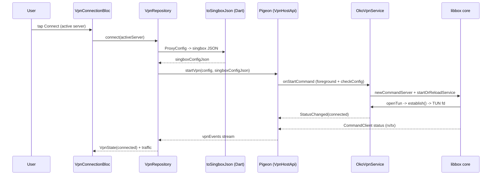

# Oko VPN: рабочий нативный VPN на Flutter

[](https://github.com/thevladoss/vpn_oko/actions/workflows/ci.yml)

Flutter-приложение поднимает реальный VPN на Android: весь трафик (`0.0.0.0/0` и
`::/0`) уходит через VLESS+Reality-сервер по вставленной подписке. Туннель гонит
встроенное ядро **sing-box** (`libbox`, собранное из v1.13.14), подключённое
напрямую в наш `VpnService` через типобезопасный мост Pigeon. Проверено на
устройстве: приложение открывает заблокированные ресурсы.

Мультипротокол работает из коробки: VLESS (Reality / XTLS / ws / grpc), VMess,
Trojan, Shadowsocks, Hysteria2. Парсер ссылок и генератор sing-box JSON написаны
на Dart и покрыты тестами.

iOS пока skeleton: extension применяет сетевые настройки, но настоящий туннель
(sing-box внутри Network Extension) отложен. Раздел [«Ограничения»](#ограничения)
называет границы прямо.

## Showcase-модель репозитория

Публичный репозиторий показывает **код и архитектуру рабочего VPN**, но
намеренно не включает само ядро.

- **Ядра в репозитории нет.** `libbox.aar` (собранный из sing-box v1.13.14) в git
  не хранится, рецепт сборки ядра не публикуется. Поэтому склонированный
  репозиторий Android-приложение без ядра **не соберёт**. Это осознанное
  решение, а не пропущенный шаг.
- **Рабочая сборка распространяется отдельно.** Демо-APK (с 5-минутным лимитом
  сессии) выдаётся по отдельной ссылке.
- **CI остаётся зелёным без ядра.** GitHub Actions гоняет `flutter analyze` и
  `flutter test`. Это чистый Dart, ядро им не нужно. Весь Dart-слой
  (парсер, генератор конфига, мапперы, Bloc/Cubit, виджеты) собирается и тестируется
  публично.

Так репозиторий доказывает архитектуру и качество кода, не раздавая готовый
обходной инструмент.

## Что делает приложение

| Возможность | Как реализовано |
|-------------|-----------------|
| Реальный туннель на Android | `libbox` берёт TUN-fd от `establish()` и проксирует весь трафик через outbound; rx/tx приходят из статистики ядра |
| Мультипротокол | Один парсер на `vless://` / `vmess://` / `trojan://` / `ss://` / `hysteria2://`; VLESS покрывает Reality, XTLS-flow, ws и grpc |
| Генерация конфига ядра | Чистая Dart-функция `ProxyConfig → sing-box JSON`, отдельные тесты на каждый протокол и транспорт |
| Управление серверами | Добавление вставкой `vless://`, зашифрованное хранилище, список, переключение активного, удаление |
| Демо-лимит | Нативный таймер режет сессию на 5:00 и включает кулдаун 2 минуты между сессиями |

## Запуск

### Требования

- Flutter 3.44.5 stable (Dart 3.12.2)
- JDK 17
- Android SDK: minSdk 26 (Android 8.0), targetSdk 36 (по умолчанию Flutter 3.44)
- Xcode 16+ (только для сборки iOS)

### Dart-слой: анализ и тесты (без ядра)

Публичная часть проверяется без `libbox`:

```bash
flutter pub get
flutter analyze
flutter test
```

Тот же набор гоняет CI. Регенерация Pigeon нужна только при правке контракта
`pigeons/vpn_api.dart`:

```bash
dart run pigeon --input pigeons/vpn_api.dart
```

Схема Drift пересобирается при правке таблиц:

```bash
dart run build_runner build --delete-conflicting-outputs
```

### Android: рабочая сборка

Gradle подключает ядро как `implementation(files("libs/libbox.aar"))`. Репозиторий
этот файл не содержит (см. [Showcase-модель](#showcase-модель-репозитория)), поэтому
без ядра сборка приложения падает на этапе линковки. С предоставленным
`android/app/libs/libbox.aar`:

```bash
flutter run
```

VPN-диалог согласия и живой Connect → трафик → Disconnect работают на устройстве
или эмуляторе API 26+.

### iOS: skeleton

Открывается в Xcode, выберите свою команду в Signing & Capabilities и запускайте
на устройстве:

```bash
open ios/Runner.xcworkspace
```

Extension поднимается и применяет `setTunnelNetworkSettings`, но настоящий core в
него ещё не встроен (см. [«Ограничения»](#ограничения)).

## Структура проекта

```
lib/
├── app/                      composition root (di.dart), MaterialApp (app.dart)
├── core/
│   ├── bridge/               Pigeon vpn_api.g.dart + VpnBridge (демультиплексор)
│   ├── error/                Failure-типы
│   └── theme/                темы, токены, типографика, VpnStatus
└── features/
    ├── vpn_connection/       мост, экран, ирис, демо-таймер (domain/data/presentation)
    ├── vpn_logs/             живой блок логов
    └── server_config/        парсер, генератор конфига, хранилище, карточка сервера
pigeons/vpn_api.dart          контракт моста (источник кодогена)
android/app/src/main/kotlin/  VpnService, libbox-интеграция, event bus, host api
android/app/libs/libbox.aar   ядро sing-box (не в git, showcase-модель)
ios/Runner/ + ios/PacketTunnel/  Swift-мост + NE-таргет (skeleton)
test/                         321 автотест: парсер, генератор, мапперы, Bloc, виджеты
.github/workflows/ci.yml      CI: flutter analyze + flutter test
```

## Использовано open-source

Ядро VPN и весь Flutter-стек взяты готовыми, версии зафиксированы.

| Компонент | Версия | Роль |
|-----------|--------|------|
| **sing-box** | v1.13.14 (`libbox` через `gomobile bind`) | Ядро VPN: outbound-протоколы, tun-inbound, роутинг; встроено в наш native-слой |
| `pigeon` | `^27.1.1` | Кодоген типобезопасного моста Flutter ↔ Kotlin/Swift |
| `flutter_bloc` | `^9.1.1` | State management, event-driven машина состояний |
| `drift` + `sqlite3_flutter_libs` | `^2.34.2` | Реактивное SQL-хранилище серверов (SQLite3MultipleCiphers) |
| `flutter_secure_storage` | `^10.3.1` | Ключ шифрования БД в Keychain / EncryptedSharedPreferences |
| `equatable` | `^2.1.0` | Value equality доменных моделей (sealed + immutable) |
| `google_fonts` | `^8.1.0` | Шрифты Inter / JetBrainsMono / SpaceGrotesk (офлайн-бандл) |
| `very_good_analysis` | `^10.3.0` | Строгий линтинг, `flutter analyze` на CI (dev) |
| `mocktail` + `bloc_test` | `^1.0.5` / `^10.0.0` | Моки и тесты Bloc-переходов без кодогена (dev) |
| `drift_dev` + `build_runner` | `2.34.0` | Кодоген схемы БД (dev) |

## Написано самостоятельно

| Область | Что написано |
|---------|--------------|
| Мост и домен | Контракт `pigeons/vpn_api.dart`, `VpnBridge` (единственный подписчик event-канала, демультиплексор по sealed-событиям), мапперы DTO → entity, sealed-модели `VpnState` / `ProxyConfig` / `TrafficStats` |
| Парсер ссылок | `parseProxyUrl`: `vless://` (Reality / XTLS-flow / ws / grpc), `vmess://` (base64-json), `trojan://`, `ss://` (плейн и base64), `hysteria2://`. Каждая схема с TDD и edge-кейсами |
| Генератор конфига | `buildSingboxConfig` / `toSingboxJson`: чистая функция `ProxyConfig → sing-box JSON` (tun-inbound `gvisor`, DNS через proxy, outbound по протоколу); тест на каждый протокол и транспорт |
| Android-интеграция ядра | `OkoVpnService` (`Libbox.newCommandServer`, `startOrReloadService`, `CommandClient` для живых rx/tx, единый teardown, FGS `systemExempted`, `onRevoke`), `OkoPlatformInterface` (`openTun` → `establish`, `protect`, монитор интерфейса, `getInterfaces`, connection owner) |
| Хранилище серверов | Схема Drift, шифрование через SQLite3MultipleCiphers, ключ в `flutter_secure_storage`, CRUD и выбор активного сервера, реактивный список |
| Демо-лимит | Нативный таймер сессии `DemoLimit` + `DemoCooldownStore` (кулдаун переживает перезапуск), событие `DemoExpiredMessage`, восстановление через `getStatus()` |
| UI | `iris_painter.dart` (CustomPainter ирис-индикатора), `VpnConnectionBloc`, `LogsCubit`, `ServerConfigCubit`, `ServerListCubit`, виджеты (кнопка с прогрессом, таймер, панели трафика и логов, карточка сервера, protocol-badge, latency-pill), дизайн-система `core/theme/` |
| iOS-мост | `VpnHostApiImpl` (`NETunnelProviderManager`), `VpnStatusObserver` (`NEVPNStatus` → Flutter), `PacketTunnelProvider` (skeleton), entitlements, `scripts/*.rb` (добавление NE-таргета через `xcodeproj`) |
| Тесты | 321 автотест в `test/`: парсер (все протоколы), генератор JSON, мапперы, переходы Bloc/Cubit (включая error, `onRevoke`, демо-истечение и кулдаун), виджеты |

## Архитектура

Feature-first clean architecture. Presentation зависит только от domain, data
реализует доменные интерфейсы, весь обмен с native идёт через один Pigeon-мост.
Ключевой поток: ссылка `vless://` парсится в `ProxyConfig`, `toSingboxJson`
собирает конфиг ядра на Dart, строка уходит через `startVpn` в `OkoVpnService`,
`libbox` берёт TUN-fd от `establish()` и проксирует трафик. Пунктирные стрелки
показывают обратный поток событий (`StatusChanged`, `LogMessage`,
`TrafficChanged`, `DemoExpired`, `Error`).

```mermaid
flowchart TD
  UI["Presentation: VpnHomeScreen + widgets<br/>(iris indicator, logs, server card)"] -->|user intent| BLOC["Bloc/Cubit: VpnConnectionBloc,<br/>ServerListCubit, LogsCubit"]
  BLOC -->|calls| UC["Usecases: ConnectVpn, DisconnectVpn,<br/>WatchVpnState, WatchTraffic"]
  UC -->|domain interfaces| REPO["Repositories: VpnRepository,<br/>ServerRepository, LogRepository"]
  REPO -->|active server| GEN["Dart: parseProxyUrl -> ProxyConfig<br/>-> toSingboxJson (singbox config)"]
  GEN --> BR["VpnBridge<br/>(single owner of Pigeon stream)"]
  REPO -->|encrypted CRUD| DB["Drift + SQLite3MultipleCiphers<br/>(key in secure storage)"]
  BR -->|VpnHostApi startVpn(singboxConfigJson)| PG["Pigeon generated<br/>Dart Kotlin Swift"]
  PG -.->|EventChannelApi vpnEvents| BR
  PG --> ANDROID["Android: VpnHostApiImpl<br/>-> OkoVpnService"]
  PG --> IOS["iOS: VpnHostApiImpl<br/>-> NETunnelProviderManager"]
  ANDROID --> CORE["libbox core (sing-box)<br/>newCommandServer -> startOrReloadService"]
  CORE --> TUN["OkoPlatformInterface.openTun<br/>-> Builder.establish() -> TUN fd -> proxy 0.0.0.0/0"]
  IOS --> NE["PacketTunnelProvider (skeleton)<br/>setTunnelNetworkSettings"]
  CORE -.->|CommandClient status: rx/tx| PG
  ANDROID -.->|StatusChanged / LogMessage / DemoExpired / Error| PG
  NE -.->|NEVPNStatus observer| IOS
  IOS -.->|events| PG
```

Поток одного Connect по шагам:



Маппинг слоёв на файлы:

| Слой | Файлы | Роль |
|------|-------|------|
| presentation | `lib/features/*/presentation/` | Виджеты + Bloc/Cubit; ирис-индикатор `iris_painter.dart`, панель логов, экран управления серверами |
| domain | `lib/features/*/domain/` | sealed/immutable entity, usecases, интерфейсы репозиториев, парсер и генератор конфига |
| data | `lib/features/*/data/` | Реализации репозиториев, мапперы DTO → entity, Drift-хранилище, датасорсы поверх `VpnBridge` |
| core/bridge | `lib/core/bridge/` | `vpn_api.g.dart` (Pigeon) + `VpnBridge`, единственный подписчик event-канала |
| Android native | `android/.../vpn/`, `android/.../bridge/` | `OkoVpnService`, `OkoPlatformInterface`, `DemoLimit`, `DemoCooldownStore`, `VpnEventBus`, `VpnHostApiImpl` |
| iOS native | `ios/Runner/Bridge/`, `ios/PacketTunnel/` | `VpnHostApiImpl`, `VpnStatusObserver`, `PacketTunnelProvider` (skeleton) |

## Ограничения

Границы названы прямо:

- **iOS ещё skeleton.** Extension поднимается и вызывает `setTunnelNetworkSettings`,
  но `Libbox.xcframework` в него не встроен: трафик на iOS пока не проксируется.
  Рабочая платформа сейчас только Android. Ядро отложено из-за лимита памяти
  Network Extension (около 50 МБ): интеграция требует отдельного memory-safe
  цикла packet flow.
- **Демо-лимит 5 минут.** Нативный таймер режет сессию на 5:00 и включает кулдаун
  2 минуты. Это рычаг демо-версии, а не техническое ограничение туннеля.
- **Клиентский лимит обходим декомпиляцией.** Он держит демо-модель, а не защищает
  от снятия. Для демо-цели этого достаточно.
- **Репозиторий не собирает Android без ядра.** `libbox.aar` и рецепт его сборки в
  git не входят (см. [Showcase-модель](#showcase-модель-репозитория)); рабочая
  сборка идёт по отдельной ссылке на APK.
- **Проверка «трафик идёт» требует живого сервера.** Нужен рабочий VLESS+Reality
  (или иной поддержанный протокол); секреты держатся вне репозитория.
