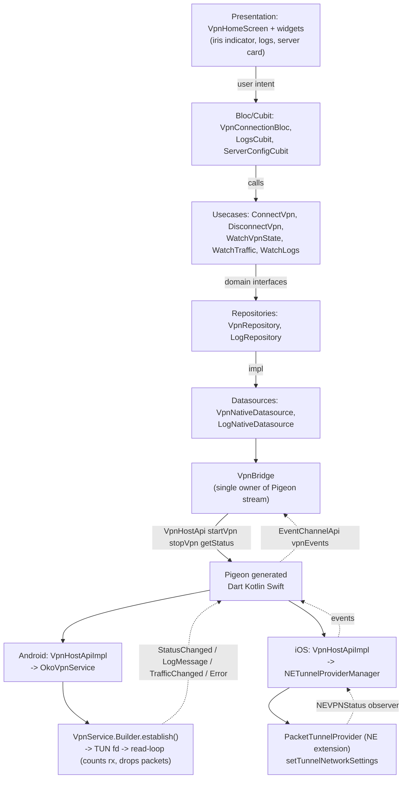
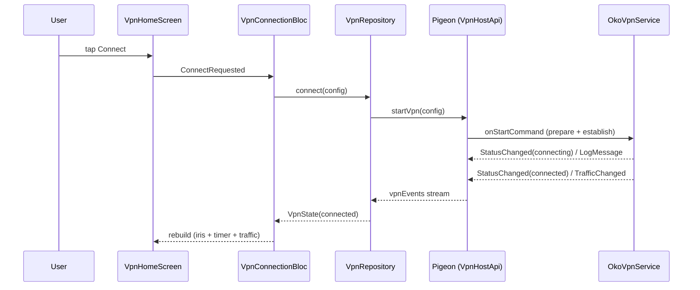

# Oko VPN — прототип нативного VPN на Flutter

[](https://github.com/thevladoss/vpn_oko/actions/workflows/ci.yml)

Прототип по тестовому заданию. Flutter-приложение управляет реальным Android
`VpnService` через типобезопасный мост Pigeon и показывает живой поток статусов,
логов и трафика из native-слоя. iOS работает через настоящий Network Extension
(`PacketTunnelProvider`): реальный туннель поднят и проверен на физическом
устройстве (iPhone, iOS 26) с dev-подписью — extension стартует, применяет
сетевые настройки и доводит статус Connected до Flutter.

Реального VPN-core в прототипе нет: трафик не проксируется, а путь его интеграции
описан разделом [«План интеграции VPN-core»](#план-интеграции-vpn-core). Раздел
[«Ограничения»](#ограничения) перечисляет границы прототипа прямо, без приукрашивания.

## Запуск

### Требования

- Flutter 3.44.5 stable (Dart 3.12.2)
- JDK 17
- Android SDK: minSdk 26 (Android 8.0), targetSdk 36 (по умолчанию Flutter 3.44)
- Xcode 16+ — только для сборки iOS

### Команды

```bash
# Зависимости из pubspec.lock
flutter pub get

# Pigeon-код уже закоммичен (lib/core/bridge/vpn_api.g.dart).
# Регенерация нужна только при правке контракта pigeons/vpn_api.dart:
dart run pigeon --input pigeons/vpn_api.dart

# Android — устройство или эмулятор API 26+:
flutter run

# iOS — открыть ios/Runner.xcworkspace в Xcode, выбрать свою команду
# в Signing & Capabilities и запустить на устройстве (нужен платный
# Apple Developer-аккаунт; симулятор packet-tunnel NE не исполняет):
open ios/Runner.xcworkspace

# Анализ и тесты:
flutter analyze
flutter test
```

Живой путь Connect → трафик → Disconnect работает на Android из коробки. Для iOS
откройте `ios/Runner.xcworkspace` в Xcode, выберите свою команду и запустите на
устройстве — причина в разделе
[«iOS: Network Extension»](#ios-network-extension).

## Структура проекта

```
lib/
├── app/                      # composition root (di.dart), MaterialApp (app.dart)
├── core/
│   ├── bridge/               # Pigeon vpn_api.g.dart + VpnBridge (демультиплексор)
│   ├── error/                # Failure-типы
│   └── theme/                # темы, токены, типографика, VpnStatus
└── features/
    ├── vpn_connection/       # domain / data / presentation (мост, экран, ирис)
    ├── vpn_logs/             # живой блок логов
    └── server_config/        # VLESS-парсер, карточка сервера, tcping
pigeons/vpn_api.dart          # контракт моста (источник кодогена)
android/app/src/main/kotlin/  # VpnService, foreground-сервис, event bus, host api
ios/Runner/ + ios/PacketTunnel/  # Swift-мост + NE-таргет
test/                         # 154 автотеста: парсер, мапперы, Bloc, виджеты
.github/workflows/ci.yml      # CI: flutter analyze + flutter test
```

## Использовано open-source

Все версии зафиксированы в `pubspec.yaml`. Фаза подачи новых пакетов не добавляет.

| Пакет | Версия | Роль |
|-------|--------|------|
| `pigeon` | `^27.1.1` | Кодоген типобезопасного моста Flutter ↔ Kotlin/Swift |
| `flutter_bloc` | `^9.1.1` | State management, event-driven машина состояний |
| `equatable` | `^2.1.0` | Value equality доменных моделей (sealed + immutable) |
| `google_fonts` | `^8.1.0` | Шрифты Inter / JetBrainsMono / SpaceGrotesk (офлайн-бандл) |
| `very_good_analysis` | `^10.3.0` | Строгий линтинг, `flutter analyze` на CI (dev) |
| `mocktail` | `^1.0.5` | Моки без кодогена (dev) |
| `bloc_test` | `^10.0.0` | Тесты Bloc/Cubit-переходов (dev) |

## Написано самостоятельно

| Область | Что написано |
|---------|--------------|
| Мост и домен | Контракт `pigeons/vpn_api.dart`, `VpnBridge` (единственный подписчик event-канала, демультиплексор по sealed-событиям), мапперы DTO → entity, модели `VpnState` / `VpnConfig` / `TrafficStats` / `VlessConfig` |
| Android | `OkoVpnService` (Builder, `establish()`, read-loop с подсчётом rx, FGS `systemExempted`, `onRevoke`, единый teardown), `VpnConsentGateway` (флоу `prepare()`), `VpnEventBus` (потокобезопасная шина, replay статуса), `VpnConnectionState` (машина переходов), `VpnHostApiImpl`, `VpnNotificationFactory` |
| iOS | `VpnHostApiImpl` (реальный `NETunnelProviderManager`), `VpnStatusObserver` (`NEVPNStatus` → Flutter), `PacketTunnelProvider` (skeleton туннеля с узким маршрутом), entitlements, `scripts/add_packet_tunnel_target.rb` (добавление NE-таргета через гем xcodeproj) |
| VLESS | Парсер `vless://` (чистая функция поверх `Uri.parse` с валидацией порта и UUID), `SocketLatencyProbe` (tcping), маскировка UUID |
| UI | `iris_painter.dart` (CustomPainter ирис-индикатора), `VpnConnectionBloc`, `LogsCubit`, `ServerConfigCubit`, виджеты (кнопка с прогрессом, таймер, панели трафика и логов, карточка сервера), дизайн-система `core/theme/` (токены, обе темы, типографика, motion) |
| Тесты | 154 автотеста в `test/`: парсер (11+ edge-кейсов), мапперы, переходы Bloc/Cubit (включая error и `onRevoke`), виджеты |

## Архитектура

Feature-first clean architecture. Presentation зависит только от domain, data
реализует доменные интерфейсы, а весь обмен с native идёт через один Pigeon-мост.
Диаграмма прослеживает сценарий Connect слева направо и вниз: тап пользователя →
Bloc → usecase → repository → `VpnBridge` → Pigeon → Android `OkoVpnService` или
iOS `PacketTunnelProvider`. Пунктирные стрелки — обратный поток событий
(`StatusChanged`, `LogMessage`, `TrafficChanged`, `Error`).



Поток одного Connect по шагам:



Маппинг слоёв на файлы:

| Слой | Файлы | Роль |
|------|-------|------|
| presentation | `lib/features/*/presentation/` | Виджеты + Bloc/Cubit; ирис-индикатор `iris_painter.dart` (CustomPainter), панель логов, карточка сервера |
| domain | `lib/features/*/domain/` | sealed/immutable entity, usecases, интерфейсы репозиториев |
| data | `lib/features/*/data/` | Реализации репозиториев, мапперы DTO → entity, датасорсы поверх `VpnBridge` |
| core/bridge | `lib/core/bridge/` | `vpn_api.g.dart` (Pigeon) + `VpnBridge` — единственный подписчик event-канала |
| Android native | `android/.../vpn/`, `android/.../bridge/` | `OkoVpnService`, `VpnConsentGateway`, `VpnEventBus`, `VpnConnectionState`, `VpnHostApiImpl` |
| iOS native | `ios/Runner/Bridge/`, `ios/PacketTunnel/` | `VpnHostApiImpl`, `VpnStatusObserver`, `PacketTunnelProvider` |

## iOS: Network Extension

iOS-туннель живёт в отдельном extension-процессе. Контейнерное приложение
`Runner.app` держит `NETunnelProviderManager` и стартует туннель, а
`PacketTunnel.appex` исполняет `PacketTunnelProvider`. Приложение и расширение
несут общую App Group `group.com.example.vpnOko` (в прототипе канал обмена не
задействован — задел под VPN-core).

```
Runner.app (контейнер)                     PacketTunnel.appex (extension)
  Bridge/VpnHostApiImpl.swift                PacketTunnelProvider : NEPacketTunnelProvider
    NETunnelProviderManager                    startTunnel -> setTunnelNetworkSettings
    load -> save -> loadFromPreferences ->       (NEPacketTunnelNetworkSettings +
    connection.startVPNTunnel/stopVPNTunnel       узкий маршрут 10.111.222.0/24)
  Bridge/VpnStatusObserver.swift               stopTunnel
    NEVPNStatusDidChange -> VpnStatusMessage
       | App Group: group.com.example.vpnOko (задел под core)
```

### Bundle identifiers

- Контейнер: `com.example.vpnOko`
- Extension: `com.example.vpnOko.PacketTunnel`
- App Group: `group.com.example.vpnOko`

### Capabilities и entitlements

Оба таргета несут одинаковые entitlements (`ios/Runner/Runner.entitlements`,
`ios/PacketTunnel/PacketTunnel.entitlements`):

- `com.apple.developer.networking.networkextension` → `packet-tunnel-provider`
- `com.apple.security.application-groups` → `group.com.example.vpnOko`

Info.plist расширения (`ios/PacketTunnel/Info.plist`):

- `NSExtensionPointIdentifier` = `com.apple.networkextension.packet-tunnel` (без `-provider`)
- `NSExtensionPrincipalClass` = `$(PRODUCT_MODULE_NAME).PacketTunnelProvider`

### Ограничение симулятора

iOS Simulator не хостит packet-tunnel Network Extension: `simctl install`
приложения со встроенным NE-appex падает с `Invalid placeholder attributes`. Это
ограничение платформы Apple, не проекта. Поэтому:

- **Автоматически проверено:** обе цели (`Runner` и `PacketTunnel.appex`)
  компилируются под device и simulator; строки bundle id, entitlements и App Group
  корректны; Dart-маппинг NE-статусов и ошибок покрыт unit-тестами.
- **На симуляторе** Swift-мост исполняет честный путь ошибки: `connecting → error`
  плюс лог «Network Extension недоступен в симуляторе». Это доказывает реальный
  вызов `NETunnelProviderManager.loadAllFromPreferences`, а не заглушку.
- **На устройстве** проверено вживую: `neagent` запускает extension-процесс,
  `PacketTunnelProvider.startTunnel` применяет `NEPacketTunnelNetworkSettings`, а
  `NEVPNStatus` доходит до Connected и до Flutter-экрана (подтверждено системными
  логами устройства).

### Запуск на устройстве

1. Откройте `ios/Runner.xcworkspace` в Xcode.
2. В Signing & Capabilities выберите свою команду — Xcode с автоподписью сам
   регистрирует App ID обоих таргетов, App Group и provisioning-профили.
3. Выберите физическое устройство и нажмите Run.
4. На устройстве дайте VPN-разрешение и нажмите Connect.

Нужен платный Apple Developer-аккаунт и реальное устройство: симулятор
packet-tunnel Network Extension не исполняет. TestFlight/App Store Connect не
требуются — сборка ставится напрямую dev-подписью.

## План интеграции VPN-core

Прототип поднимает туннель, но не проксирует трафик: реального VPN-core в нём нет.
Шов для core уже подготовлен, и ниже названы точные точки подключения в коде.

### Точки подключения

**Android — `OkoVpnService.startReadLoop()`**
(`android/app/src/main/kotlin/com/example/vpn_oko/vpn/OkoVpnService.kt`). Сейчас
поток читает пакеты из `pfd.fileDescriptor` в буфер и дропает их, суммируя только
прочитанные байты (`rx.addAndGet(read)`); tx не измеряется, тикер шлёт
`TrafficChangedMessage(rx.get(), 0L)`. Сюда встаёт core:

- `Builder.establish()` уже отдаёт TUN `ParcelFileDescriptor`.
- Вместо read-loop дескриптор уходит в core: `libbox` / sing-box принимает fd
  туннеля и берёт на себя чтение, запись и проксирование.
- Колбэк `VpnService.protect(socket)` защищает исходящий сокет core от зацикливания
  обратно в туннель.

**iOS — `PacketTunnelProvider.startTunnel`**
(`ios/PacketTunnel/PacketTunnelProvider.swift`). Сейчас метод только вызывает
`setTunnelNetworkSettings`, а `self.packetFlow` не читает. Реальный core:

- Тот же sing-box, собранный под iOS, запускается внутри extension-процесса.
- Цикл `packetFlow.readPackets` ↔ core ↔ `packetFlow.writePackets` (либо core сам
  держит tun через адаптер `Libbox`).

### Предлагаемый интерфейс VpnCore

В коде такого интерфейса пока нет — это план. Реальный `VpnCore` без реализации не
вводится, чтобы не плодить мёртвый код (его ловит `very_good_analysis`). Эскиз
сигнатур для обеих платформ:

```kotlin
// Android: android/.../vpn/VpnCore.kt (план, файла нет)
interface VpnCore {
  fun start(tunFd: ParcelFileDescriptor, config: VlessConfig, protect: (Int) -> Boolean)
  fun stop()
  fun stats(): TrafficStats   // rx + tx из core, а не из read-loop
}
// LibboxVpnCore оборачивает gomobile-биндинг libbox;
// OkoVpnService.startReadLoop заменяется на vpnCore.start(descriptor, config, ::protect)
```

```swift
// iOS: ios/PacketTunnel/VpnCore.swift (план, файла нет)
protocol VpnCore {
  func start(packetFlow: NEPacketTunnelFlow, config: VlessConfig) throws
  func stop()
}
// LibboxVpnCore внутри PacketTunnelProvider.startTunnel вместо голого setTunnelNetworkSettings
```

Pigeon-контракт при этом не меняется: `startVpn(VpnConfigMessage)` плюс поток
событий уже покрывают интеграцию. Фасад заложен под core, менять его не придётся.

### Механика gomobile / JNI

| Платформа | Артефакт | Инструмент | Механика |
|-----------|----------|-----------|----------|
| Android | `libbox.aar` (или `libXray.aar`) | `gomobile bind -target=android` | AAR несёт `.so` под ABI + JNI-обёртку; core вызывается in-process из `OkoVpnService`, без gRPC/localhost |
| iOS | `Libbox.xcframework` | `gomobile bind -target=ios` | XCFramework линкуется в extension-таргет; Swift зовёт Obj-C-биндинг core |
| Flutter ↔ native | — | Pigeon (уже есть) | Dart FFI **не место интеграции**: core живёт в native VPN-процессе, а Flutter остаётся UI-слоем поверх Pigeon-моста |

Частая ошибка — тянуть core в Dart через FFI. Core запускается в нативном
VPN-процессе (Android Service, iOS NE extension), а Flutter общается с native
только через Pigeon.

### Варианты core

| Core | Артефакт | Рекомендация |
|------|----------|--------------|
| **sing-box / libbox** | `.aar` + `.xcframework` из `gomobile bind` | Первичный: единый core на обе платформы, VLESS-outbound из коробки |
| **Xray-core / libXray** | gomobile-обёртка Xray → `.aar` / `.xcframework` | Альтернатива, если нужен именно Xray/XTLS |
| **libv2ray** | легаси gomobile-биндинг v2ray | Исторический вариант эпохи v2ray, не рекомендуется |

`VlessConfig` (распарсен на Dart в фазе 4) передаётся через `startVpn` → на native
собирается sing-box JSON с `vless`-outbound → отдаётся в core (ориентировочно
`Libbox.newService(config)`; конкретные имена символов API не проверены и даны как
план, не как рабочий вызов).

## Ограничения

Прототип честно очерчен. Границы названы прямо, без «полноценного VPN»:

- **Реального core нет — трафик не проксируется.** Туннель поднимается, но пакеты не
  шифруются и не уходят на сервер. Путь интеграции описан разделом выше.
- **tx всегда 0.** Read-loop считает только прочитанные байты (rx); отправку никто
  не измеряет, тикер шлёт `TrafficChangedMessage(rx, 0L)`.
- **Маршрут узкий — `10.111.222.0/24`, не `0.0.0.0/0`.** Интернет устройства
  продолжает работать в статусе Connected; счётчик rx растёт от `ping` в подсеть
  туннеля. Это осознанное решение демо, не забытая настройка.
- **iOS-туннель проверяется на реальном устройстве.** Симулятор
  packet-tunnel Network Extension не исполняет — это ограничение платформы Apple.
- **Вставленный `vless://`-конфиг — display-only.** Карточка показывает разобранные
  поля и задержку, но в реальный Connect ссылка не проводится:
  `VpnConnectionBloc.config` остаётся демо-конфигом (`host echo.oko.vpn`, UUID
  `00000000-0000-0000-0000-000000000000`).

## Что дальше

Направления по тестовому заданию и требованиям v2, если продолжать прототип:

- **Реальный VPN-core** через `VpnCore` из плана выше: sing-box/libbox как `.aar` и
  `.xcframework`, подключённый в `startReadLoop` и `startTunnel`.
- **Чтение трафика на iOS**: цикл `packetFlow.readPackets` / `writePackets`, чтобы
  extension считал реальные rx/tx, а не только поднимал туннель.
- **Kill switch и split tunneling**: блокировка трафика при разрыве и маршрутизация
  по приложениям поверх настоящего core.
