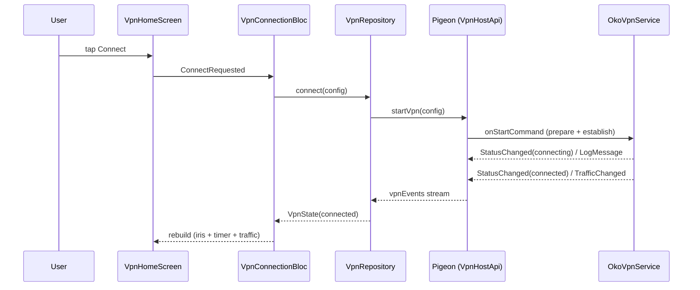

# Oko VPN — прототип нативного VPN на Flutter

[](https://github.com/<owner>/<repo>/actions/workflows/ci.yml)

> Замените `<owner>/<repo>` на реальные owner и имя репозитория после создания
> публичного GitHub-репозитория и первого прогона CI (workflow `ci.yml`, name `CI`).

Прототип по тестовому заданию. Flutter-приложение управляет реальным Android
`VpnService` через типобезопасный мост Pigeon и показывает живой поток статусов,
логов и трафика из native-слоя. iOS работает через настоящий Network Extension
(`PacketTunnelProvider`) и проверяется на устройстве в TestFlight.

Реального VPN-core в прототипе нет: трафик не проксируется, а путь его интеграции
описан разделом [«План интеграции VPN-core»](#план-интеграции-vpn-core). Раздел
[«Ограничения»](#ограничения) перечисляет границы прототипа прямо, без приукрашивания.

## Запуск

### Требования

- Flutter 3.44.5 stable (Dart 3.12.2)
- JDK 17
- Android SDK: minSdk 26 (Android 8.0), targetSdk 36 (по умолчанию Flutter 3.44)
- Xcode 16+ — только для сборки iOS

### Команды

```bash
# Зависимости из pubspec.lock
flutter pub get

# Pigeon-код уже закоммичен (lib/core/bridge/vpn_api.g.dart).
# Регенерация нужна только при правке контракта pigeons/vpn_api.dart:
dart run pigeon --input pigeons/vpn_api.dart

# Android — устройство или эмулятор API 26+:
flutter run

# iOS — сборка архива и прогон через TestFlight на устройстве
# (симулятор packet-tunnel Network Extension не исполняет):
flutter build ipa

# Анализ и тесты:
flutter analyze
flutter test
```

Живой путь Connect → трафик → Disconnect работает на Android из коробки. Для iOS
соберите архив и прогоните на устройстве через TestFlight — причина в разделе
[«iOS: Network Extension»](#ios-network-extension).

## Структура проекта

```
lib/
├── app/                      # composition root (di.dart), MaterialApp (app.dart)
├── core/
│   ├── bridge/               # Pigeon vpn_api.g.dart + VpnBridge (демультиплексор)
│   ├── error/                # Failure-типы
│   └── theme/                # темы, токены, типографика, VpnStatus
└── features/
    ├── vpn_connection/       # domain / data / presentation (мост, экран, ирис)
    ├── vpn_logs/             # живой блок логов
    └── server_config/        # VLESS-парсер, карточка сервера, tcping
pigeons/vpn_api.dart          # контракт моста (источник кодогена)
android/app/src/main/kotlin/  # VpnService, foreground-сервис, event bus, host api
ios/Runner/ + ios/PacketTunnel/  # Swift-мост + NE-таргет
test/                         # 122 теста: парсер, мапперы, Bloc, виджеты
.github/workflows/ci.yml      # CI: flutter analyze + flutter test
```

## Пять фаз сборки

Прототип собирался снизу вверх: сначала контракт и домен, затем самый рискованный
шов (Android `VpnService`), поверх него UI, потом VLESS-парсер и iOS.

1. **Фундамент и Pigeon-мост** — типобезопасный контракт Flutter ↔ native,
   доменные sealed/immutable модели, echo-реализации на обеих платформах.
2. **Android `VpnService`** — реальный туннель через consent-флоу `prepare()`,
   foreground-сервис, живые события статусов, логов и трафика.
3. **Flutter UI** — экран по DESIGN.md: ирис-индикатор пяти состояний, живые логи,
   таймер, счётчики трафика, восстановление состояния после перезапуска.
4. **VLESS-конфиг сервера** — парсер `vless://`, карточка сервера с маскировкой
   UUID, измерение задержки через tcping.
5. **iOS-мост и Network Extension** — Swift-реализация Pigeon-моста, реальный
   `PacketTunnelProvider`, entitlements и App Group, готовность к TestFlight.

## Использовано open-source

Все версии зафиксированы в `pubspec.yaml`. Фаза подачи новых пакетов не добавляет.

| Пакет | Версия | Роль |
|-------|--------|------|
| `pigeon` | `^27.1.1` | Кодоген типобезопасного моста Flutter ↔ Kotlin/Swift |
| `flutter_bloc` | `^9.1.1` | State management, event-driven машина состояний |
| `equatable` | `^2.1.0` | Value equality доменных моделей (sealed + immutable) |
| `google_fonts` | `^8.1.0` | Шрифты Inter / JetBrainsMono / SpaceGrotesk (офлайн-бандл) |
| `very_good_analysis` | `^10.3.0` | Строгий линтинг, `flutter analyze` на CI (dev) |
| `mocktail` | `^1.0.5` | Моки без кодогена (dev) |
| `bloc_test` | `^10.0.0` | Тесты Bloc/Cubit-переходов (dev) |

## Написано самостоятельно

| Область | Что написано |
|---------|--------------|
| Мост и домен | Контракт `pigeons/vpn_api.dart`, `VpnBridge` (единственный подписчик event-канала, демультиплексор по sealed-событиям), мапперы DTO → entity, модели `VpnState` / `VpnConfig` / `TrafficStats` / `VlessConfig` |
| Android | `OkoVpnService` (Builder, `establish()`, read-loop с подсчётом rx, FGS `systemExempted`, `onRevoke`, единый teardown), `VpnConsentGateway` (флоу `prepare()`), `VpnEventBus` (потокобезопасная шина, replay статуса), `VpnConnectionState` (машина переходов), `VpnHostApiImpl`, `VpnNotificationFactory` |
| iOS | `VpnHostApiImpl` (реальный `NETunnelProviderManager`), `VpnStatusObserver` (`NEVPNStatus` → Flutter), `PacketTunnelProvider` (skeleton туннеля с узким маршрутом), entitlements, `scripts/add_packet_tunnel_target.rb` (добавление NE-таргета через гем xcodeproj) |
| VLESS | Парсер `vless://` (чистая функция поверх `Uri.parse` с валидацией порта и UUID), `SocketLatencyProbe` (tcping), маскировка UUID |
| UI | `iris_painter.dart` (CustomPainter ирис-индикатора), `VpnConnectionBloc`, `LogsCubit`, `ServerConfigCubit`, виджеты (кнопка с прогрессом, таймер, панели трафика и логов, карточка сервера), дизайн-система `core/theme/` (токены, обе темы, типографика, motion) |
| Тесты | 122 объявления в `test/`: парсер, мапперы, переходы Bloc/Cubit (включая error и `onRevoke`), виджеты |

## Архитектура

Feature-first clean architecture. Presentation зависит только от domain, data
реализует доменные интерфейсы, а весь обмен с native идёт через один Pigeon-мост.
Диаграмма прослеживает сценарий Connect слева направо и вниз: тап пользователя →
Bloc → usecase → repository → `VpnBridge` → Pigeon → Android `OkoVpnService` или
iOS `PacketTunnelProvider`. Пунктирные стрелки — обратный поток событий
(`StatusChanged`, `LogMessage`, `TrafficChanged`, `Error`).

```mermaid
flowchart TD
  UI["Presentation: VpnHomeScreen + widgets<br/>(iris indicator, logs, server card)"] -->|user intent| BLOC["Bloc/Cubit: VpnConnectionBloc,<br/>LogsCubit, ServerConfigCubit"]
  BLOC -->|calls| UC["Usecases: ConnectVpn, DisconnectVpn,<br/>WatchVpnState, WatchTraffic, WatchLogs"]
  UC -->|domain interfaces| REPO["Repositories: VpnRepository, LogRepository"]
  REPO -->|impl| DS["Datasources: VpnNativeDatasource,<br/>LogNativeDatasource"]
  DS --> BR["VpnBridge<br/>(single owner of Pigeon stream)"]
  BR -->|VpnHostApi: startVpn / stopVpn / getStatus| PG["Pigeon generated<br/>(Dart / Kotlin / Swift)"]
  PG -.->|@EventChannelApi vpnEvents| BR
  PG --> ANDROID["Android: VpnHostApiImpl<br/>-> OkoVpnService"]
  PG --> IOS["iOS: VpnHostApiImpl<br/>-> NETunnelProviderManager"]
  ANDROID --> TUN["VpnService.Builder.establish()<br/>-> TUN fd -> read-loop (counts rx, drops packets)"]
  IOS --> NE["PacketTunnelProvider (NE extension)<br/>setTunnelNetworkSettings"]
  TUN -.->|StatusChanged / LogMessage / TrafficChanged / Error| PG
  NE -.->|NEVPNStatus observer| IOS
  IOS -.->|events| PG
```

Поток одного Connect по шагам:



Маппинг слоёв на файлы:

| Слой | Файлы | Роль |
|------|-------|------|
| presentation | `lib/features/*/presentation/` | Виджеты + Bloc/Cubit; ирис-индикатор `iris_painter.dart` (CustomPainter), панель логов, карточка сервера |
| domain | `lib/features/*/domain/` | sealed/immutable entity, usecases, интерфейсы репозиториев |
| data | `lib/features/*/data/` | Реализации репозиториев, мапперы DTO → entity, датасорсы поверх `VpnBridge` |
| core/bridge | `lib/core/bridge/` | `vpn_api.g.dart` (Pigeon) + `VpnBridge` — единственный подписчик event-канала |
| Android native | `android/.../vpn/`, `android/.../bridge/` | `OkoVpnService`, `VpnConsentGateway`, `VpnEventBus`, `VpnConnectionState`, `VpnHostApiImpl` |
| iOS native | `ios/Runner/Bridge/`, `ios/PacketTunnel/` | `VpnHostApiImpl`, `VpnStatusObserver`, `PacketTunnelProvider` |

## iOS: Network Extension

iOS-туннель живёт в отдельном extension-процессе. Контейнерное приложение
`Runner.app` держит `NETunnelProviderManager` и стартует туннель, а
`PacketTunnel.appex` исполняет `PacketTunnelProvider`. Приложение и расширение
обмениваются данными через App Group `group.com.example.vpnOko`.

```
Runner.app (контейнер)                     PacketTunnel.appex (extension)
  Bridge/VpnHostApiImpl.swift                PacketTunnelProvider : NEPacketTunnelProvider
    NETunnelProviderManager                    startTunnel -> setTunnelNetworkSettings
    load -> save -> loadFromPreferences ->       (NEPacketTunnelNetworkSettings +
    connection.startVPNTunnel/stopVPNTunnel       узкий маршрут 10.111.222.0/24)
  Bridge/VpnStatusObserver.swift               stopTunnel
    NEVPNStatusDidChange -> VpnStatusMessage
       | App Group: group.com.example.vpnOko (обмен app <-> extension)
```

### Bundle identifiers

- Контейнер: `com.example.vpnOko`
- Extension: `com.example.vpnOko.PacketTunnel`
- App Group: `group.com.example.vpnOko`

### Capabilities и entitlements

Оба таргета несут одинаковые entitlements (`ios/Runner/Runner.entitlements`,
`ios/PacketTunnel/PacketTunnel.entitlements`):

- `com.apple.developer.networking.networkextension` → `packet-tunnel-provider`
- `com.apple.security.application-groups` → `group.com.example.vpnOko`

Info.plist расширения (`ios/PacketTunnel/Info.plist`):

- `NSExtensionPointIdentifier` = `com.apple.networkextension.packet-tunnel` (без `-provider`)
- `NSExtensionPrincipalClass` = `$(PRODUCT_MODULE_NAME).PacketTunnelProvider`

### Ограничение симулятора

iOS Simulator не хостит packet-tunnel Network Extension: `simctl install`
приложения со встроенным NE-appex падает с `Invalid placeholder attributes`. Это
ограничение платформы Apple, не проекта. Поэтому:

- **Автоматически проверено:** обе цели (`Runner` и `PacketTunnel.appex`)
  компилируются под device и simulator; строки bundle id, entitlements и App Group
  корректны; Dart-маппинг NE-статусов и ошибок покрыт unit-тестами.
- **На симуляторе** Swift-мост исполняет честный путь ошибки: `connecting → error`
  плюс лог «Network Extension недоступен в симуляторе». Это доказывает реальный
  вызов `NETunnelProviderManager.loadAllFromPreferences`, а не заглушку.
- **На устройстве (TestFlight)** проверяется реальный старт туннеля через
  `NETunnelProviderManager` → `PacketTunnelProvider.startTunnel`, применение
  `NEPacketTunnelNetworkSettings` и доведение `NEVPNStatus` до Flutter-экрана.

### Путь к TestFlight

1. В Apple Developer portal зарегистрируйте два App ID: `com.example.vpnOko` и
   `com.example.vpnOko.PacketTunnel`; включите у обоих Network Extensions и App
   Groups (`group.com.example.vpnOko`).
2. Заведите provisioning profiles для обоих таргетов.
3. `flutter build ipa` (или Xcode Archive схемы `Runner`) → загрузка в App Store
   Connect → TestFlight.
4. На устройстве установите сборку из TestFlight, дайте VPN-разрешение, нажмите Connect.
